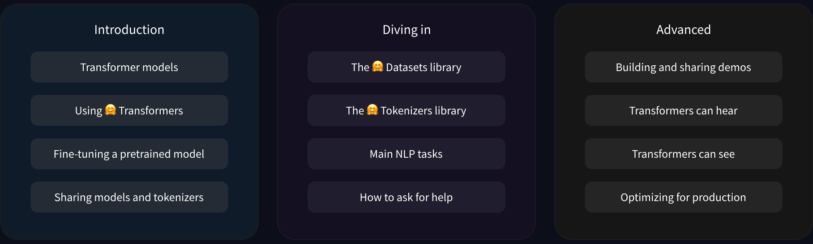

# Tranformer Models

## Introduction 

The first thing to keep in mind is the difference between NLP and LLMs, which are both taught in this course.

Starting with **NLP** or **Natural Language Processing** :

- Is the broader field 
- Focused on enabling computers to understand, interpret and generate human language
- Encompasses techniques like sentiment analysis, named entity recognition and machine translation

Now touching on **LLMs** or **Large Language Models** :

- Subset of NLP models
- Massive size and extensive training data 
- Ability to perform a wide range of language tasks with minimal task-specific training
- Some examples : Llama, GPT, Claude, Gemini, Mistral, etc...

What I will be learning in this course :

